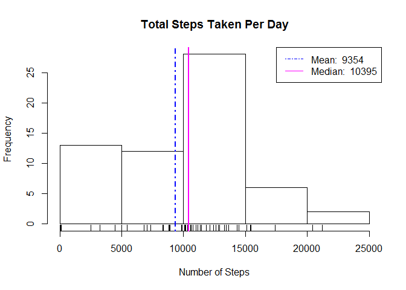
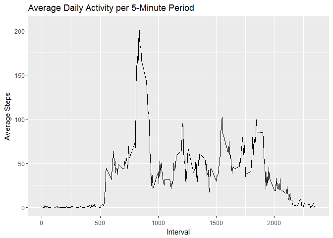
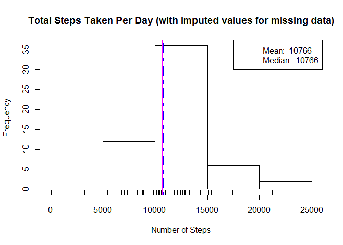
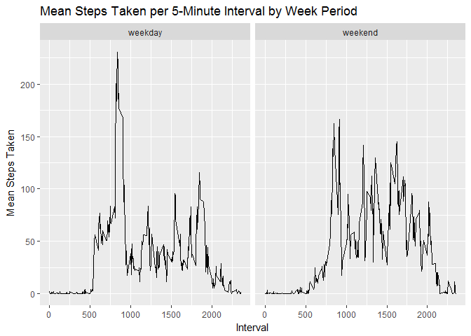

# Reproducible Research: Peer Assessment 1

## Loading and preprocessing the data
We will analyze the number of steps taken by an individual subject during a 61 day period. Measurements were taken in five minute intervals.  

Before we can begin analyzing the data, we must first retrieve the data and bring it into R.


```r
fileURL = "https://d396qusza40orc.cloudfront.net/repdata%2Fdata%2Factivity.zip"
temp = tempfile()

if(!dir.exists("./data")){ 
     dir.create("./data")
}
if(!file.exists("./data/activity.csv")){
     download.file(fileURL, destfile = temp, method = "libcurl")
     unzip(temp, exdir = "./data")
     unlink(temp)
}
rm("fileURL", "temp")

activity <- read.csv("./data/activity.csv", na.strings = "NA")
```


## What is mean total number of steps taken per day?

First, we will look at the total number of steps taken per day, ignoring missing data.


```r
suppressPackageStartupMessages(library(dplyr))

dategrpsums <- (activity %>% 
     group_by(date) %>%
     summarise(totalsteps = sum(steps, na.rm = TRUE)))[,2] %>%
     unlist()

datetotmean <- mean(dategrpsums)
datetotmed <- median(dategrpsums)
hist(dategrpsums,
     xlab = "Number of Steps", main = "Total Steps Taken Per Day")
rug(dategrpsums)
abline(v = datetotmean, col = "blue", lwd = 2, lty = 4)
abline(v = datetotmed, col = "magenta", lwd = 2)
legend("topright", lty = c(4, 1), col = c("blue", "magenta"), 
       legend = c(paste("Mean: ",round(datetotmean)),
                  paste("Median: ",datetotmed)))
```

<!-- -->


## What is the average daily activity pattern?

How active was the subject daily during each of the 5-minute intervals?


```r
suppressPackageStartupMessages(library(ggplot2))

intvalgrp <- activity %>% 
     group_by(interval) %>% 
     summarise(Avg.Steps = mean(steps, na.rm = TRUE))

maxact <- unlist(intvalgrp[match(max(intvalgrp$Avg.Steps),intvalgrp$Avg.Steps),1])

ggplot(intvalgrp, aes(interval, Avg.Steps))+geom_line()+
     labs(x = "Interval", y = "Average Steps", 
          title = "Average Daily Activity per 5-Minute Period")
```

<!-- -->


The 5-minute interval showing the greated average activity is **835**

## Imputing missing values

Let's take another look at the total number of steps per day. There were quite a lot of missing values in the dataset. 2304 missing values to be exact.

This time, we'll impute any missing data rather than ignoring it by setting NA values equal to the average for that particular 5-minute interval.


```r
iactivity <- left_join(activity, intvalgrp, by = c("interval" = "interval"))
iactivity[is.na(iactivity$steps),1] <- iactivity[is.na(iactivity$steps),4]
iactivity <- iactivity[,1:3]

idategrpsums <- (iactivity %>% 
     group_by(date) %>%
     summarise(totalsteps = sum(steps, na.rm = TRUE)))[,2] %>%
     unlist()

idatetotmean <- mean(idategrpsums)
idatetotmed <- median(idategrpsums)
hist(idategrpsums,
     xlab = "Number of Steps", main = "Total Steps Taken Per Day (with imputed values for missing data)")
rug(idategrpsums)
abline(v = idatetotmean, col = "blue", lwd = 4, lty = 4)
abline(v = idatetotmed, col = "magenta", lwd = 2)
legend("topright", lty = c(4, 1), col = c("blue", "magenta"), 
       legend = c(paste("Mean: ",round(idatetotmean)),
                  paste("Median: ",round(idatetotmed))))
```

<!-- -->

As can be seen, imputing the missing values by using average numbers has shifted the median little from our first value 10395 to this one 10766. The mean values have shifted more significantly with our first value of 9354 appreciably below the median while this mean value equals the median.

## Are there differences in activity patterns between weekdays and weekends?


```r
suppressPackageStartupMessages(library(lubridate))

weekend <- c("Saturday", "Sunday")
iactivity$date <- ymd(iactivity$date)

iactivity <- mutate(iactivity, week.period = 
                         if_else(weekdays(date) %in% weekend,
                                 "weekend","weekday"))
igrpact <- iactivity %>% 
     group_by(interval, week.period) %>%
     summarise(mint = mean(steps))

ggplot(igrpact, aes(interval, mint))+
     geom_line()+
     facet_grid(.~week.period)+
     labs(x = "Interval", 
          y = "Mean Steps Taken",
          title = "Mean Steps Taken per 5-Minute Interval by Week Period")
```

<!-- -->
